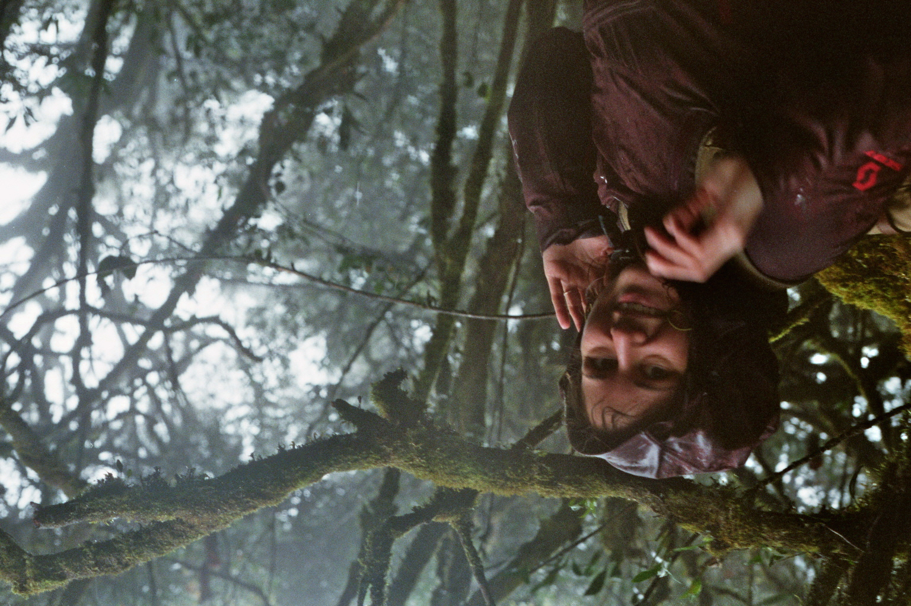

# 5 Frames in Malaysia

As I am writing this, I have been stuck inside for most of the last three weeks due to the Coronavirus Pandemic. At this point I am missing going out to a Cafe or maybe the cinema a lot, and intercontinental travel seems like it wont be possible in the foreseeable future.

One thing that can still lift my spirit is going through photos from the travels i was so fortunate to take over the last years. Today I'm going to share some of my photographs taken while traveling Malaysia in late December 2018 and January 2019.

