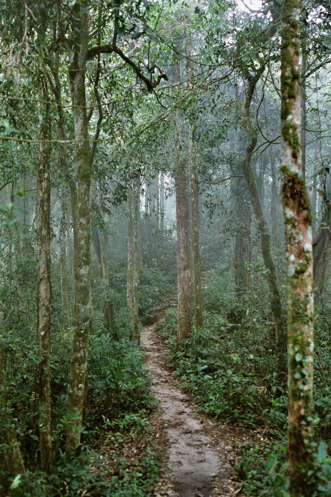
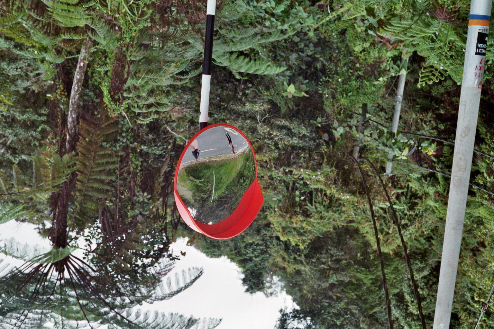
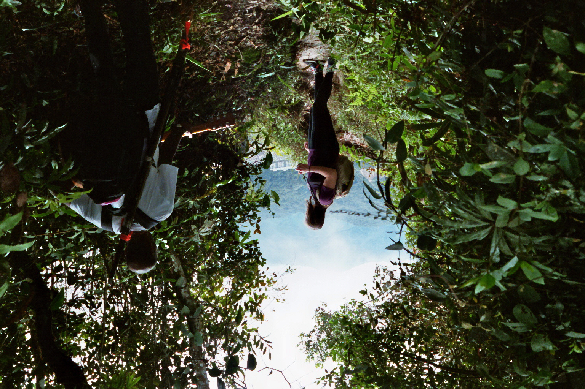
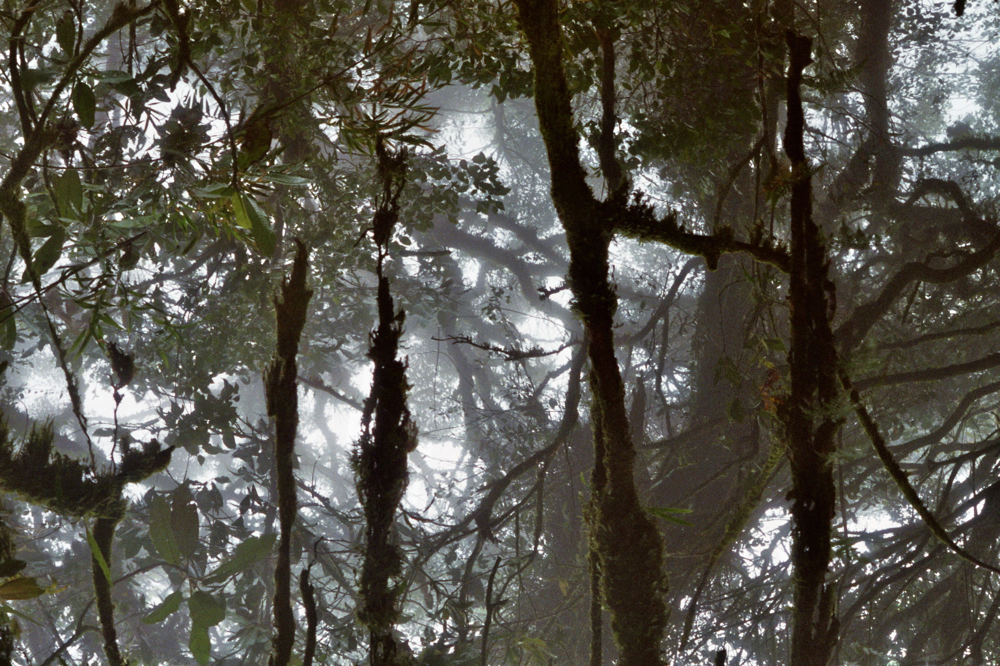

# 5 Photos from Malaysia

As I am writing this, I have been stuck inside for most of the last three weeks due to the Coronavirus Pandemic. At this point I am missing going out to a Cafe or maybe the cinema a lot, and intercontinental travel seems like it wont be possible in the foreseeable future.

One thing that can still lift my spirit is going through photos from the travels i was so fortunate to take over the last years. Today I'm going to share some of my photographs from Cameron Highlands, Malaysia in January 2019.

This highland region north of Kuala Lumpur offers a unique climate with moderate temperatures (10-25C) at an intense humidity. Tea plantations and strawberry farms are are the main agricultural industries, although at least partly these serve for tourist entertainment. If you ever visit, be aware that the Cameron Highlands are not a secret spot but very popular with foreign and domestic tourists alike.
 
Often this overpresent tourist industry would limit my enjoyment of a place, but the nature of Cameron Highlands was absolutely captivating for me and, if you have never seen it before, a tea plantation is worth exploring after all.

Fortunately there are several hiking trails that you can explore on your own. For us these were not too physically demanding, but you should certainly bring water and decent shoes. 

Looking for the start of the trail we were joined by a fellow traveller from the netherlands. We soon decided to hike the trail together, because shared experiences are better experiences (and because multiple hours in the wilderness in a foreign country can be a bit intimidating).

Looking back down from iur trail, the clouds would only momentarily offer a glimpse at the town of Tana Ratha. We did find a good musical backdrop though.

The next day we took a tour of the local cloud forest, which is a tropical forest constantly covered in low-level clouds. This area is called the Mossy Forest, a very fitting name although I can´t help myself referring to it as Dagobah.

In the cloud forest you will observe an enormous diversity in plants and animals, with many species being endemic to this ecosystem, . This particular explorer was very happy with her visit and will happily share her fascination should you ever get to ask her about it.

